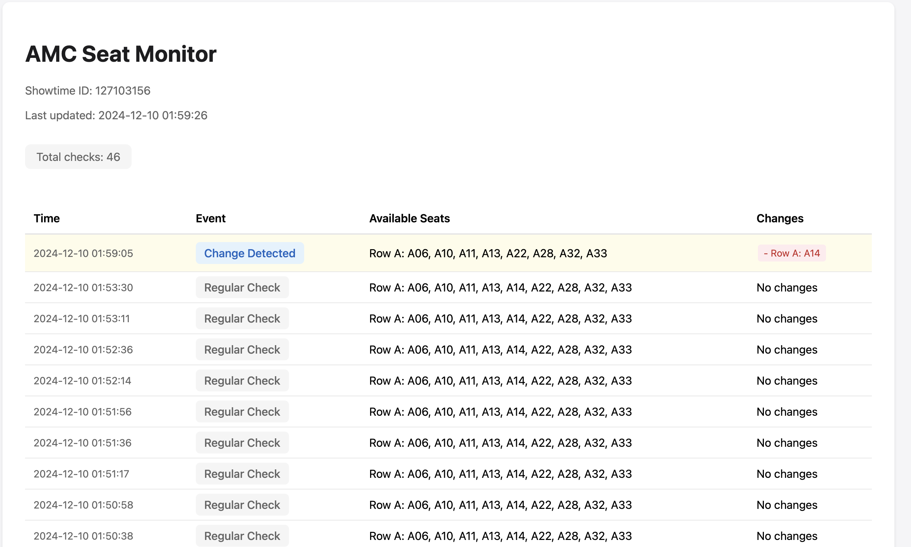

# AMC Seat Monitor

A Python-based tool for monitoring and tracking seat availability changes for AMC theater showtimes. This tool helps you keep track of seat availability in real-time, with desktop notifications and a live updating web interface.



## Features

- 🎦 Real-time seat availability monitoring
- 🔔 Desktop notifications for seat changes (macOS)
- 📊 Live-updating web interface with seat history
- 📝 Detailed change logging
- 🎯 Row-based seat tracking
- 💻 Headless browser support

## Prerequisites

- Python 3.7+
- Chrome/Chromium browser
- macOS for native notifications (can be modified for other OS)
- Poetry for project dependency management

## Installation

1. Ensure you have [Python](https://www.python.org/downloads/) and [Poetry installed](https://python-poetry.org/docs/#installation):

2. Clone the repository:

```bash
git clone https://github.com/jykim256/seat-monitor.git
cd seat-monitor
```

3. Install dependencies with Poetry:

```bash
poetry install
```

## Usage

### Basic Usage

Run the monitor with a specific showtime ID:

```bash
poetry run python src/seat_monitor/main.py <showtime_id>
```

Example:

```bash
poetry run python src/seat_monitor/main.py 12345678
```

### Advanced Usage

Run with a log file to save the change history:

```bash
poetry run python src/seat_monitor/main.py <showtime_id> <log_file_path>
```

Example:

```bash
poetry run python src/seat_monitor/main.py 12345678 seat_changes.json
```

You can also run the script directly in Poetry's shell:

```bash
poetry shell
seat-monitor 12345678
```

### Finding the Showtime ID

1. Go to AMC's website and select your desired showtime
2. Click on the "Get Tickets" button
3. The URL will contain the showtime ID in the format: `.../showtimes/<showtime_id>/seats`

## Features in Detail

### Real-time Monitoring

- Checks seat availability every 15 seconds (configurable)
- Tracks changes in available seats
- Maintains a history of all changes

### Desktop Notifications

- Receives instant notifications when seats become available or unavailable
- Includes detailed information about which seats changed
- Plays a sound alert for important changes

### Web Interface

- Live-updating HTML report
- Shows complete history of seat changes
- Color-coded status indicators
- Responsive design for all screen sizes
- Auto-refreshes every second

### Logging

- Tracks all seat changes
- Records timestamps for all events
- Optional JSON log file for permanent record
- Detailed error logging

## Project Structure

```
src/seat_monitor/
├── __init__.py
├── main.py                 # Entry point and CLI handling
├── monitor.py             # Core SeatMonitor class
├── templates/
│   └── report_template.py # HTML report generation
└── utils/
    ├── __init__.py
    ├── notifications.py   # Mac notifications
    ├── seat_formatter.py  # Seat formatting utilities
    └── web_utils.py      # Web scraping logic
```

## Configuration

The monitor can be configured through several parameters in the `SeatMonitor` class:

```python
monitor = SeatMonitor(
    showtime_id="12345678",
    headless=True  # Run browser in headless mode
)

monitor.monitor_seats(
    interval=15,  # Check every 15 seconds
    log_file="changes.json"  # Optional log file
)
```

## Error Handling

The monitor includes robust error handling:

- Automatically retries on network errors
- Logs all errors with timestamps
- Continues monitoring after errors
- Maintains history of error events
